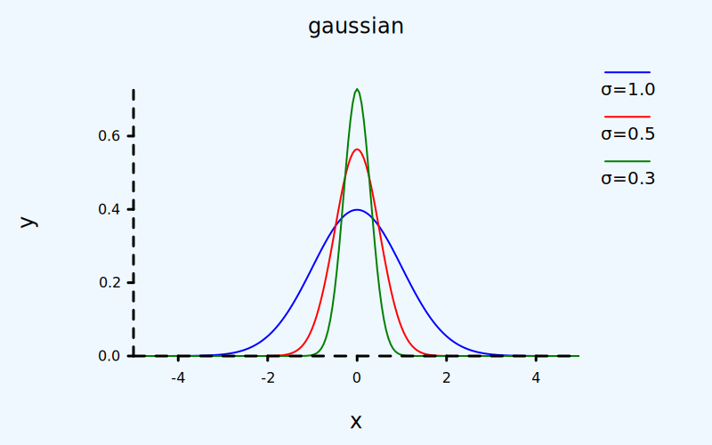
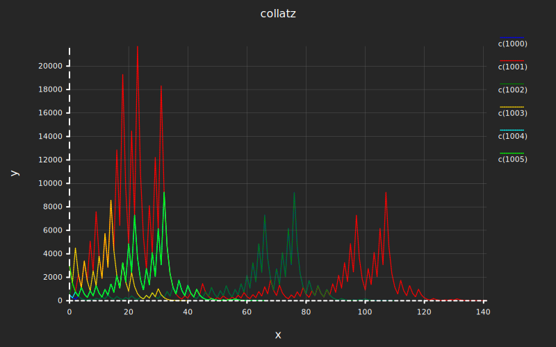
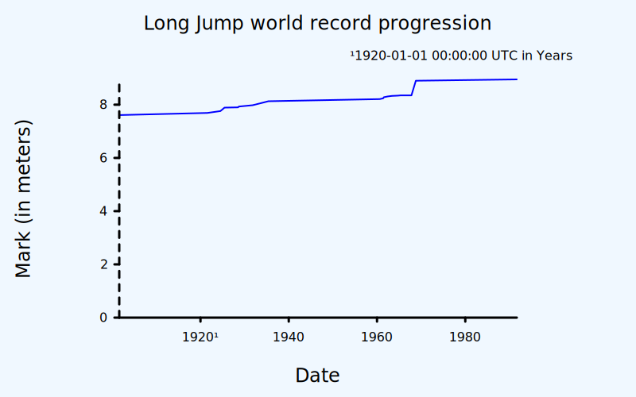
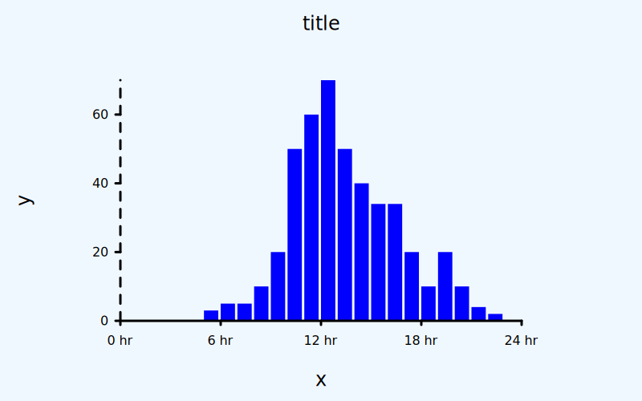
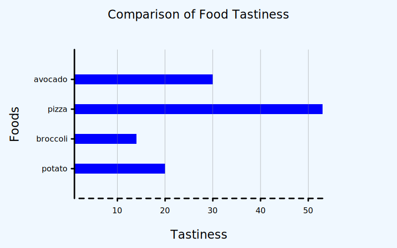
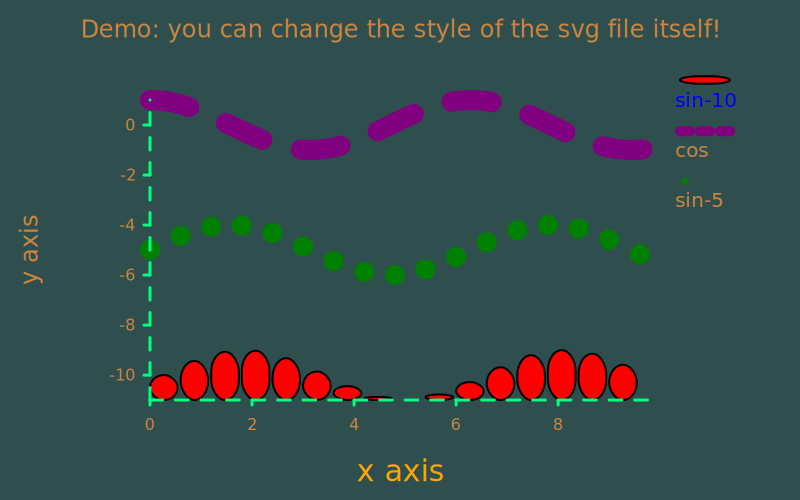
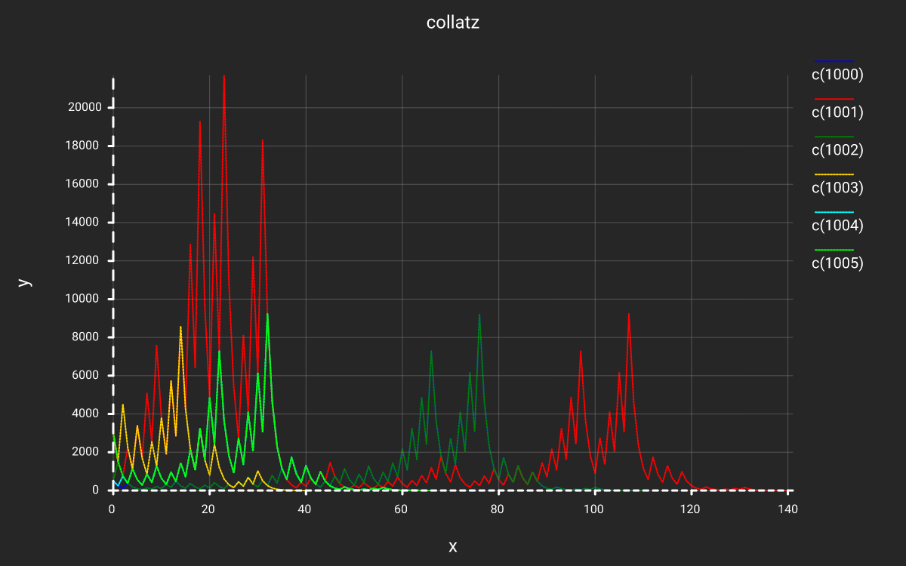

You can find poloto on [github](https://github.com/tiby312/poloto) and [crates.io](https://crates.io/crates/poloto).
Documentation at [docs.rs](https://docs.rs/poloto)

A simple 2D plotting library that outputs graphs to SVG that can be styled using CSS.

Poloto graphs can be stylized using css either directly in the SVG, or from inside of html with an embedded svg. The latter allows the user to dynamically match the svg to their website's theme. The user can take full advantage of CSS, adding highlight on hover, animation, shadows, strokes, etc. Check out the [github examples](https://github.com/tiby312/poloto/tree/master/examples) to see this. The latest graph outputs of the examples can be found in the [assets](https://github.com/tiby312/poloto/tree/master/target/assets) folder.

You can see it in action in this rust book [broccoli-book](https://tiby312.github.io/broccoli_report/)

## Gaussian Example

```rust
use poloto::build::plot;
use poloto::prelude::*;
// PIPE me to a file!
fn main() {
    // See https://en.wikipedia.org/wiki/Gaussian_function
    let gau = |sigma: f64, mu: f64| {
        use std::f64::consts::TAU;
        let s = sigma.powi(2);
        let k = (sigma * TAU).sqrt().recip();
        move |x: f64| (-0.5 * (x - mu).powi(2) / s).exp() * k
    };

    let r = poloto::util::range_iter([-5.0, 5.0], 200);

    let plots = poloto::plots!(
        plot("σ=1.0").line().buffered(r.zip_output(gau(1.0, 0.))),
        plot("σ=0.5").line().buffered(r.zip_output(gau(0.5, 0.))),
        plot("σ=0.3").line().buffered(r.zip_output(gau(0.3, 0.))),
        poloto::build::origin()
    );

    poloto::data(plots)
        .build_and_label(("gaussian", "x", "y"))
        .append_to(poloto::header().light_theme())
        .render_stdout();
}

```
## Output




## Collatz Example

```rust
use hypermelon::prelude::*;
use poloto::prelude::*;

// PIPE me to a file!
fn main() {
    let collatz = |mut a: i128| {
        std::iter::from_fn(move || {
            if a == 1 {
                None
            } else {
                a = if a % 2 == 0 { a / 2 } else { 3 * a + 1 };
                Some(a)
            }
        })
        .fuse()
    };

    let svg = poloto::header().with_viewbox_width(1200.0);

    let opt = poloto::render::render_opt()
        .with_tick_lines([true, true])
        .with_viewbox(svg.get_viewbox())
        .move_into();

    let style =
        poloto::render::Theme::dark().append(".poloto_line{stroke-dasharray:2;stroke-width:2;}");

    let a = poloto::build::plots_dyn((1000..1006).map(|i| {
        let name = format_move!("c({})", i);
        let it = (0..).zip(collatz(i));
        poloto::build::plot(name).line().buffered(it)
    }));

    let b = poloto::build::origin();

    poloto::data(plots!(a, b))
        .map_opt(|_| opt)
        .build_and_label(("collatz", "x", "y"))
        .append_to(svg.append(style))
        .render_stdout();
}

```
## Output





## Timestamp Example

```rust
use poloto::num::timestamp::UnixTime;

fn main() {
    let timezone = &chrono::Utc;
    use chrono::TimeZone;

    //Source https://en.wikipedia.org/wiki/Men%27s_long_jump_world_record_progression
    let data = [
        (7.61, "05 August 1901"),
        (7.69, "23 July 1921"),
        (7.76, "07 July 1924"),
        (7.89, "13 June 1925"),
        (7.90, "07 July 1928"),
        (7.93, "09 September 1928"),
        (7.98, "27 October 1931"),
        (8.13, "25 May 1935"),
        (8.21, "12 August 1960"),
        (8.24, "27 May 1961"),
        (8.28, "16 July 1961"),
        (8.31, "10 June 1962"),
        (8.33, "25 May 1963"),
        (8.34, "12 September 1964"),
        (8.35, "29 May 1965"),
        (8.35, "19 October 1967"),
        (8.90, "18 October 1968"),
        (8.95, "30 August 1991"),
    ];

    let data = data.map(|(x, y)| {
        let d = timezone.from_utc_date(&chrono::NaiveDate::parse_from_str(y, "%d %B %Y").unwrap());
        (UnixTime::from(d), x)
    });

    let plots = poloto::plots!(
        poloto::build::plot("").line().cloned(data.iter()),
        poloto::build::markers([], [0.0])
    );

    poloto::data(plots)
        .build_and_label((
            "Long Jump world record progression",
            "Date",
            "Mark (in meters)",
        ))
        .append_to(poloto::header().light_theme())
        .render_stdout();
}

```

## Output




## Custom Ticks Example

```rust
use hypermelon::format_move;
fn main() {
    // hourly trend over one day.
    let trend = vec![
        0, 0, 0, 0, 0, 3, 5, 5, 10, 20, 50, 60, 70, 50, 40, 34, 34, 20, 10, 20, 10, 4, 2, 0,
    ];

    let it = (0..).zip(trend.iter().copied());

    let plots = poloto::plots!(
        poloto::build::plot("").histogram().cloned(it),
        poloto::build::markers([24], [])
    );

    let data = poloto::data(plots);

    let ticks =
        poloto::ticks::from_iter((0..).step_by(6)).with_tick_fmt(|&v| format_move!("{} hr", v));

    data.map_xticks(|_| ticks)
        .build_and_label(("title", "x", "y"))
        .append_to(poloto::header().light_theme())
        .render_stdout();
}

```

## Output




## Bar example

```rust
fn main() {
    let data = [
        (20, "potato"),
        (14, "broccoli"),
        (53, "pizza"),
        (30, "avocado"),
    ];

    poloto::build::bar::gen_simple("", data, [0])
        .label(("Comparison of Food Tastiness", "Tastiness", "Foods"))
        .append_to(poloto::header().light_theme())
        .render_stdout();
}

```

## Output



## Styling example

```rust
use hypermelon::prelude::*;
use poloto::build::plot;
use poloto::prelude::*;
fn main() {
    let theme = poloto::render::Theme::light();

    // Style the first plot and its legend image if it is a histogram.
    let theme =
        theme.append(".poloto0.poloto_histo.poloto_imgs{fill:red;stroke:black;stroke-width:2px}");

    // Some attributes have to accessed directly , so use >* to select the rects directly.
    let theme = theme.append(".poloto0.poloto_histo.poloto_imgs>*{rx:20px;ry:20px}");

    // Style the text of the first legend
    let theme = theme.append(".poloto0.poloto_legend.poloto_text{fill:blue;}");

    // Style all line plots but not legend img.
    let theme = theme.append(".poloto_line.poloto_imgs.poloto_plot{stroke:purple;stroke-width:20px;stroke-dasharray:40px}");

    // Style all line plot legend imgs.
    let theme = theme.append(".poloto_line.poloto_imgs.poloto_legend{stroke:purple;stroke-width:10px;stroke-dasharray:10px}");

    // Style the scatter plots but not legend img
    let theme = theme.append(".poloto_scatter.poloto_plot{fill:purple;stroke-width:20px;}");

    // Style the scatter plots but not legend img
    let theme = theme.append(".poloto_scatter.poloto_plot{fill:purple;stroke-width:20px;}");

    // Style the xaxis name
    let theme = theme.append(
        ".poloto_name.poloto_x{fill:orange;stroke-width:20px;font-size:30px;font-style: italic;}",
    );

    // Style the background
    let theme = theme.append(".poloto_background{fill:darkslategray;}");

    // Style the text
    let theme = theme.append(".poloto_text{fill: peru;}");

    // Style the ticks
    let theme = theme.append(".poloto_imgs.poloto_ticks{stroke:springgreen;}");

    let x = (0..50).map(|x| (x as f64 / 50.0) * 10.0);

    let data = poloto::plots!(
        plot("sin-10")
            .histogram()
            .buffered(x.clone().step_by(3).zip_output(|x| x.sin() - 10.)),
        plot("cos").line().buffered(x.zip_output(f64::cos)),
        plot("sin-5")
            .scatter()
            .buffered(x.clone().step_by(3).zip_output(|x| x.sin() - 5.))
    );

    poloto::data(data)
        .build_and_label((
            "Demo: you can change the style of the svg file itself!",
            "x axis",
            "y axis",
        ))
        .append_to(poloto::header().append(theme))
        .render_stdout();
}

```

## Output



### Usecases

Poloto converts each plot into svg elements like circles. Because of this its not really suitable for plots with many many plots. For those you might want to use a library to lets you plot directly to a png/jpg image instead. You can certainly rasterize the generated svg image, but generating and displaying the svg wont be all that efficient if there are a ton of plots.

### `cloned()` vs `buffered()`

poloto runs through plot iterators twice. Once to get the min/max bounds, and a second time to scale all
the plots by those min/max bounds. There are two ways to do this. One is to just clone the iterator, and consume
both. The second way is to accumulate the items from one iterator into a Vec<>, and then just iterate over that vec.
poloto forces the user to choose every time which method to use. Some scenarios:
```rust,ignore

//BAD because the entire vec of data will be duplicated in memory!
plot("").scatter().cloned(vec_of_data.into_iter());

//GOOD because we are just cloning a iterator over references.
plot("").scatter().cloned(vec_of_data.iter());

//BAD because more memory is used than necessary. We can just iterate over
//the existing vec twice returning references instead of collecting the plots into
//another vec. 
plot("").scatter().buffered(vec_of_data.into_iter());

//BAD because expensive_calc() will be called 2000 times instead of just 1000 times.
plot("").scatter().cloned((0..1000).zip_output(|x|x.expensive_calc()));

//GOOD because expensive_calc() will be called only 1000 times.
plot("").scatter().buffered((0..1000).zip_output(|x|x.expensive_calc()));


//GOOD because multiplying by 2 is fast operation that most likely
//beats buffering all the plots.
plot("").scatter().cloned((0..1000).zip_output(|x|x*2));

```


## Escape protection

If a user tried to inject html through the title/xname/yname/tick format/ or plot names, the html escapes
will get turned into their encoded values. This protection is provided by the `hypermelon` dependency crate.

## CSS Usage Example

See the graphs in this report: [broccoli_book](https://tiby312.github.io/broccoli_report/)

## CSS classes

* `poloto[n]fill` - If the n'th plot requires fill. (e.g. linefill or histogram)
* `poloto[n]stroke` - If the n'th plot requires stroke. (e.g. line or scatter)


## Iterating plots twice

In order to calculate the right size view to scale all the plots, poloto has to iterate over all the plot
points twice. Once to find the min and max bounds, and once to scale all the points by the scale determined
by the first iteration. 

If you are using an iterator where each iteration is expensive, consider running the iterator just once,
collecting the results in a Vec. Then pass that Vec to the plotting functions. 
Beware of passing the buffer directly to the plotter! If you do this, you'll use a lot of memory since 
the plotter will clone the whole buffer. Instead pass a reference to the buffer. See the second example below.


## Can I change the styling of the plots?

Yes! You can harness the power of CSS both in the svg, or outside
in html with an embedded svg. Some things you can do:

 * Change the color scheme to fit your html theme.
 * Highlight one plot, make it dashed, or add hover effect
 * Animate things using @keyframes

The `Plotter` struct documents which css classes you can modify for the graph as a whole.
Each plot function documents which css classes you can modify to change that specific plot.

Scatter plots are done using SVG paths made up of lines of zero length. This allows you to change
the radius of the scatter dots by changing the stroke width.


## Formatting Tick Intervals

Poloto will first print intervals in normal decimal at the precision required to capture the differences
in the step size between the intervals. If the magnitude of a number is detected to be too big or small, it
may switch to scientific notation, still at the required precision. It will only switch if the scientific
notation version is actually less characters than the normal decimal format which is not always the case
when you consider the precision that might be required to capture the step size.

Even with the above system, there are cases where the numbers all have a really big magnitude, but
are all really close together (small step size). In this case, there isn't really a good way to format it.
In these cases, poloto will fall back to making the number relative to the first number.

## How to render to png? 

You can use [resvg](https://crates.io/crates/resvg). Install that, and then run a command similar to:

```
resvg -w 1200 target/assets/collatz.svg target/assets/collatz.png
```

### Output


