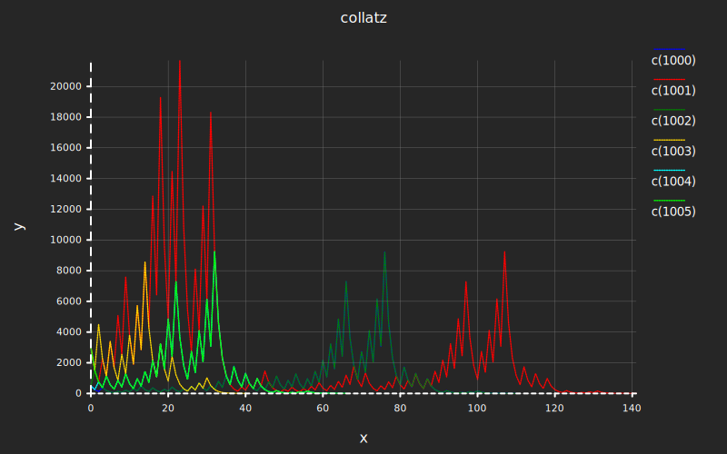

You can find poloto on [github](https://github.com/tiby312/poloto) and [crates.io](https://crates.io/crates/poloto).
Documentation at [docs.rs](https://docs.rs/poloto)

A simple 2D plotting library that outputs graphs to SVG that can be styled using CSS.

Poloto graphs can be stylized using css either directly in the SVG, or from inside of html with an embedded svg. The latter allows the user to dynamically match the svg to their website's theme. The user can take full advantage of CSS, adding highlight on hover, animation, shadows, strokes, etc. Check out the [github examples](https://github.com/tiby312/poloto/tree/master/examples) to see this. The latest graph outputs of the examples can be found in the [assets](https://github.com/tiby312/poloto/tree/master/assets) folder.

You can see it in action in this rust book [broccoli-book](https://tiby312.github.io/broccoli_report/)

## Guide

See overview at [docs.rs](https://docs.rs/poloto).


## Gaussian Example

```rust
use poloto::prelude::*;
// PIPE me to a file!
fn main() {
    // See https://en.wikipedia.org/wiki/Gaussian_function
    let gaussian = |sigma: f64, mu: f64| {
        use std::f64::consts::TAU;
        let s = sigma.powi(2);
        let k = (sigma * TAU).sqrt().recip();
        move |x: f64| (-0.5 * (x - mu).powi(2) / s).exp() * k
    };

    let range = (0..200).map(|x| (x as f64 / 200.0) * 10.0 - 5.0);

    let g1 = gaussian(1.0, 0.0);
    let g2 = gaussian(0.5, 0.0);
    let g3 = gaussian(0.3, 0.0);

    let l1 = poloto::build::line("σ = 1.0", range.clone().map(|x| [x, g1(x)]));
    let l2 = poloto::build::line("σ = 0.5", range.clone().map(|x| [x, g2(x)]));
    let l3 = poloto::build::line("σ = 0.3", range.clone().map(|x| [x, g3(x)]));

    let mut plotter = plots!(l1, l2, l3)
        .build_with([], [0.0])
        .stage()
        .plot("gaussian", "x", "y");

    print!("{}", poloto::disp(|a| plotter.simple_theme(a)));
}

```
## Output


## Collatz Example

```rust
use poloto::prelude::*;

// PIPE me to a file!
fn main() {
    let collatz = |mut a: i128| {
        std::iter::from_fn(move || {
            if a == 1 {
                None
            } else {
                a = if a % 2 == 0 { a / 2 } else { 3 * a + 1 };
                Some(a)
            }
        })
        .fuse()
    };

    let mut data = poloto::build::plots_dyn();
    for i in 1000..1006 {
        let l = poloto::build::line(formatm!("c({})", i), (0..).zip(collatz(i)));
        data.add(l);
    }
    //Make the plotting area slightly larger.
    let dim = [1300.0, 600.0];

    let canvas = poloto::render::canvas()
        .with_tick_lines(true, true)
        .with_dim(dim)
        .build();

    let mut plotter = data
        .build_with([], [0])
        .stage_with(&canvas)
        .plot("collatz", "x", "y");

    use poloto::simple_theme;
    let hh = simple_theme::determine_height_from_width(plotter.get_dim(), simple_theme::DIM[0]);

    print!(
        "{}<style>{}{}</style>{}{}",
        poloto::disp(|a| poloto::simple_theme::write_header(a, [simple_theme::DIM[0], hh], dim)),
        poloto::simple_theme::STYLE_CONFIG_DARK_DEFAULT,
        ".poloto_line{stroke-dasharray:2;stroke-width:2;}",
        poloto::disp(|a| plotter.render(a)),
        poloto::simple_theme::SVG_END
    )
}

```
## Output





## Timestamp Example

```rust
use poloto::num::timestamp::UnixTime;
use poloto::prelude::*;

fn main() {
    let timezone = &chrono::Utc;
    use chrono::TimeZone;

    //Source https://en.wikipedia.org/wiki/Men%27s_long_jump_world_record_progression
    let data = [
        (7.61, "05 August 1901"),
        (7.69, "23 July 1921"),
        (7.76, "07 July 1924"),
        (7.89, "13 June 1925"),
        (7.90, "07 July 1928"),
        (7.93, "09 September 1928"),
        (7.98, "27 October 1931"),
        (8.13, "25 May 1935"),
        (8.21, "12 August 1960"),
        (8.24, "27 May 1961"),
        (8.28, "16 July 1961"),
        (8.31, "10 June 1962"),
        (8.33, "25 May 1963"),
        (8.34, "12 September 1964"),
        (8.35, "29 May 1965"),
        (8.35, "19 October 1967"),
        (8.90, "18 October 1968"),
        (8.95, "30 August 1991"),
    ];

    let data = data.map(|(x, y)| {
        let d = timezone.from_utc_date(&chrono::NaiveDate::parse_from_str(y, "%d %B %Y").unwrap());
        (UnixTime::from(d), x)
    });

    let data = poloto::build::line("", data).build_with([], [0.0]);

    let mut plotter = data.stage().plot(
        "Long Jump world record progression",
        "Date",
        "Mark (in meters)",
    );

    print!("{}", poloto::disp(|w| plotter.simple_theme_dark(w)));
}

```

## Output


## Custom Ticks Example

```rust
use poloto::prelude::*;
fn main() {
    // hourly trend over one day.
    let trend: [i128; 24] = [
        0, 0, 0, 0, 0, 3, 5, 5, 10, 20, 50, 60, 70, 50, 40, 34, 34, 20, 10, 20, 10, 4, 2, 0,
    ];

    let it = (0..).zip(trend.into_iter());

    let data = poloto::build::histogram("", it)
        .build_with([24], [])
        .stage();

    let (_, by) = data.bounds();
    let (xtick, xtick_fmt) = poloto::ticks::from_iter((0..).step_by(6));
    let (ytick, ytick_fmt) = poloto::ticks::from_default(by);

    let mut pp = data.plot_with(
        xtick,
        ytick,
        poloto::plot_fmt(
            "Number of rides at theme park hourly",
            "Hour",
            "Number of rides",
            xtick_fmt.with_tick_fmt(|w, v| write!(w, "{} hr", v)),
            ytick_fmt,
        ),
    );

    print!("{}", poloto::disp(|w| pp.simple_theme(w)));
}

```

## Output


## Escape protection

If a user tried to inject html through the title/xname/yname/tick format/ or plot names, the html escapes
will get turned into their encoded values. This protection is provided by the `tagger` dependency crate.

## CSS Usage Example

See the graphs in this report: [broccoli_book](https://tiby312.github.io/broccoli_report/)

## CSS classes

Below are the css classes that can be stylized. There are default styles settings
for these css classes in the static strings `STYLE_CONFIG_LIGHT_DEFAULT` and `STYLE_CONFIG_DARK_DEFAULT`.

These are the css classes added through `Plotter::render`

* `poloto_text` - all poloto text
* `poloto_axis_lines` - axis lines and ticks 
* `poloto_tick_labels` - x and y labels as well as `where` labels
* `poloto_labels` - title, x label, ylabel
* `poloto_title` - title
* `poloto_xname` - xlabel
* `poloto_yname` - ylabel
* `poloto_legend_text` - legend text
* `poloto_legend_icon` - legend icon
* `poloto_scatter` - scatter plots and legend icon
* `poloto_line` - line plots and legend icon
* `poloto_histo` - histogram and legend icon 
* `poloto_linefill` - line fill and legend icon
* `poloto_linefillraw` - line fill raw and legend icon
* `poloto_tick_line` - grid lines that occur on each tick.

These are the css classes added through `poloto::SVG_HEADER` which is used by `simple_theme` and `simple_theme_dark`.

* `poloto` - default svg element

For plots:

* `poloto[n]fill` - If the n'th plot requires fill. (e.g. linefill or histogram)
* `poloto[n]stroke` - If the n'th plot requires stroke. (e.g. line or scatter)


## Iterating plots twice

In order to calculate the right size view to scale all the plots, poloto has to iterate over all the plot
points twice. Once to find the min and max bounds, and once to scale all the points by the scale determined
by the first iteration. 

If you are using an iterator where each iteration is expensive, consider running the iterator just once,
collecting the results in a Vec. Then pass that Vec to the plotting functions. 
Beware of passing the buffer directly to the plotter! If you do this, you'll use a lot of memory since 
the plotter will clone the whole buffer. Instead pass a reference to the buffer. See the second example below.


## Can I change the styling of the plots?

Yes! You can harness the power of CSS both in the svg, or outside
in html with an embeded svg. Some things you can do:

 * Change the color scheme to fit your html theme.
 * Highlight one plot, make it dashed, or add hover effect
 * Animate things using @keyframes

The `Plotter` struct documents which css classes you can modify for the graph as a whole.
Each plot function documents which css classes you can modify to change that specific plot.

Scatter plots are done using SVG paths made up of lines of zero length. This allows you to change
the radius of the scatter dots by changing the stroke width.


## Formatting Tick Intervals

Poloto will first print intervals in normal decimal at the precision required to capture the differences
in the step size between the intervals. If the magnitude of a number is detected to be too big or small, it
may switch to scientific notation, still at the required precision. It will only switch if the scientific
notation version is actually less characters than the normal decimal format which is not always the case
when you consider the precision that might be required to capture the step size.

Even with the above system, there are cases where the numbers all have a really big magnitude, but
are all really close together (small step size). In this case, there isn't really a good way to format it.
In these cases, poloto will fall back to making the number relative to the first number.